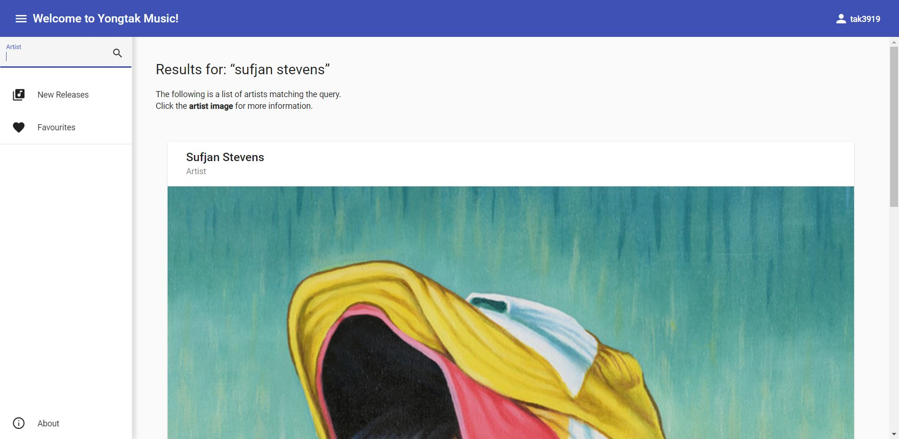

# Yongtak Music

This application leverages services in Angular to enable the app to fetch real data from the Spotify Web API.

### Live Demo

https://priceless-murdock-3177db.netlify.app

- It may take longer to load the first page since its server runs on the Heroku free tier.

### Screenshots

### Key Features

- This application is designed to be used only if the user logs in. (JWT is used.)
- When a user clicks on an album cover or artist name, it goes to the corresponding detail page.
- Users are able to search for an artist to find the album or song they want.
- Users can save their favourite songs in their "Favourites" list.
- Users can play small audio snippets if audio samples are available.

### Technologies

- Angular
- Nodejs (Express)
- MongoDB
- Libraries: mongoose, JWT, Bcrypt, dotenv, cors

### Links

Click [Yongtak Music](https://github.com/yongtakjeon/spotifyApp)
